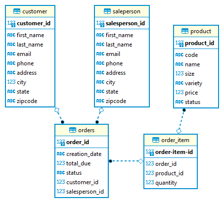

# Introduction
The JDBC application performs CRUD operations (Create, Read, Update, Delete) on a database using the JDBC API. A PostgreSQL database running in a Docker container was used, along with Maven to manage packages and dependencies and Git for version control.

# Implementation
## ER Diagram

## Design Patterns
The DAO pattern abstracts database operations and puts them in a separate object, making it easier to change the database implementation without affecting the rest of the application. DAO also provides a clean separation of concerns between the database and business logic.

The Repository pattern provides a higher-level interface to access data by putting the details of the data storage behind a common interface. This makes it easier to manage data across multiple sources while also providing a way to abstract the database-specific implementation details.

# Test
The application was tested manually by using the PostgreSQL instance to check if the CRUD operations were successful. A bash script was run to check the status of the docker container and start the PSQL instance. Test data was loaded into the database and the query results were compared to the expected results.