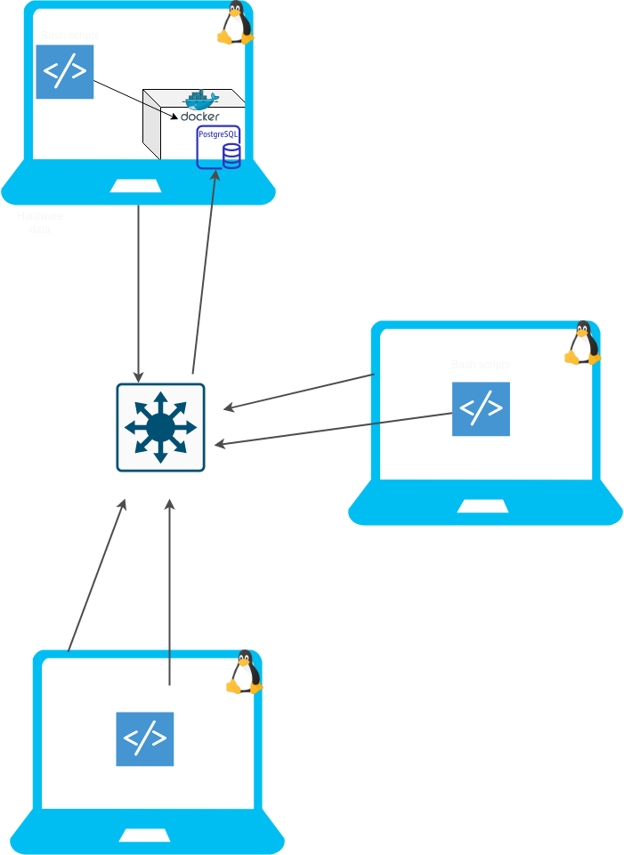

# Introduction
This project requires designing and implementing an MVP that helps the Jarvis Linux Cluster Administration (LCA) team to record the hardware specifications of each node and monitor node resource usage. The data collected will be stored in an RDBMS to generate reports for future resource planning purposes. The users of this system are the LCA team, who will be writing SQL queries to answer business questions. Technologies used in this project include Linux command lines, Bash scripts, PostgreSQL, Docker, IDE, and networking protocols. The Linux cluster of 10 nodes/servers is internally connected through a switch and able to communicate through internal IPv4 addresses. The project aims to provide a solution to the LCA team to monitor the resources used by each node and plan future resource requirements effectively.

# Quick Start
```
# Start a psql instance using psql_docker.sh
bash scripts/psql_docker.sh [start | stop | create] [db_username] [db_pasword]

Create the database tables in PSQL with ddl.sql:
psql -h psql_host -U psql_user -d db_name -f sql/ddl.sql

# Insert hardware specs data into DB with host_info.sh 
bash scripts/host_info.sh psql_host psql_port db_name psql_user psql_password

# Insert hardware usage data into DB with host_usage.sh
bash scripts/host_usage.sh psql_host psql_port db_name psql_user psql_password

# Crontab setup script to run usage data collection every minute
* * * * * bash path/to/linux_sql/scripts/host_usage.sh  psql_host psql_port db_name psql_user psql_password &> /tmp/host_usage.log
```

# Implemenation
1. Made a Bash script that can create a Docker container running a PostgreSQL instance.
2. Created a DDL file using PostgreSQL that defines two tables inside the `host_agent` database: `host_info` and `host_usage`. The `host_info` table would store information about the hosts' hardware specs, while the `host_usage` table stores information about hosts' hardware usage.
3. Wrote `host_info.sh` and `host_usage.sh` scripts to get and store hardware specs and usage data.
4. Used crontab to get host hardware usage data every one minute and insert it into the database.

## Architecture


## Scripts
### Creating, starting & stopping a PSQL Docker container
```
# Create a psql instance
./scripts/psql_docker.sh create [db_username] [db_password]

# Start the psql container
./scripts/psql_docker.sh start

# Stop the psql container
./scripts/psql_docker.sh stop
```


### Adding a new host:
```
# Create host info table and host usage table
./scripts/host_info.sh psql_host psql_port db_name psql_user psql_password
```
### Collecting usage data:
`bash scripts/host_usage.sh psql_host psql_port db_name psql_user psql_password`
### Crontab setup:
```
# Launch crontab editor
crontab -e
# Add line
* * * * * bash /path/to/linux_sql/scripts/host_usage.sh psql_host port db_name psql_user psql_password &> /tmp/host_usage.log
```

## Database Modeling
#### Schema for 'host_info'

Attribute | Type | Description
--------- | -----| -----------
id | serial | Unique automatically incremented number to identify each host. Primary key.
hostname | varchar |  Unique name for every host.
cpu_number | smallint | The number of CPU cores.
cpu_architecture | varchar | The type of architecture of the processor.
cpu_model | varchar | Name of CPU model.
cpu_mhz | decimal | CPU clock speed in MHz.
l2_cache | integer | L2 memory cache size in kB.
total_mem | integer | Size of total memory (RAM) in kB
timestamp | timestamp | The time when this record was collected.

#### Schema for 'host_usage'

Attribute | Type | Description
--------- | -----| -----------
timestamp | timestamp | The time when this record was collected.
host_id | integer | ID corresponding to the same host in the 'host_info' table. Foreign key.
memory_free | integer | The amount of available memory (RAM).
cpu_idle | smallint | Percentage of time that the CPU spends idle.
cpu_kernal | smallint | Percentage of time that the CPU spends running in kernal mode.
disk_io | integer | The number of disk input/out processes.
disk_available | integer | Root directory disk space available in MB.

# Test
### Bash Scripts Testing
- All scripts were tested using bash -x.
- `host_info.sh` and `host_usage.sh` were tested using database SELECT statements to see if data was inserted properly after execution.
- `psql_docker.sh` was tested using Docker CLI to verify if the container was created successfully.
### SQL Testing
- `ddl.sql` was tested using PostgreSQL CLI to see if the tables were created.

# Deployment
Github was used for version control and Docker containers were used to house the PSQL instance. Crontab was used to run the `host_usage.sh` every minute to collect hardware usage data.

# Improvements
- Warn the user when resources are used up.
- Add support for other operating systems.
- Create a backup storage system, as the database exists on only one of the machines.